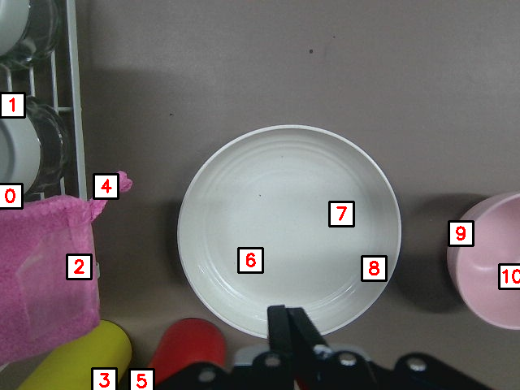

### 纯 2D 版本 ReKep 的 func （DINOv2+SAM2 / DINOv2+SAM2.1）

选择两张图进行测试

#### 图片1

| sam2 | sam2.1 |
| :---: | :---: |
|

**结果展示：**

**DINOv2 + SAM2：**

|  |  |  |
| --- | --- | --- |
| |  |  |

**DINOv2 + SAM2.1：**

|  |  |  |
| --- | --- | --- |
| |  |  |

---

#### 对比说明

- **上排（1-3.png）**：DINOv2 + SAM2 的处理结果
- **下排（4-6.png）**：DINOv2 + SAM2.1 的处理结果
- **从左到右**：原图 → 分割结果 → 关键点检测结果

#### 图片2

| sam2 | sam2.1 |
| :---: | :---: |
|

**结果展示：**

**DINOv2 + SAM2：**

|  |  |  |
| --- | --- | --- |
| |  |  |

**DINOv2 + SAM2.1：**

|  |  |  |
| --- | --- | --- |
| |  |  |
